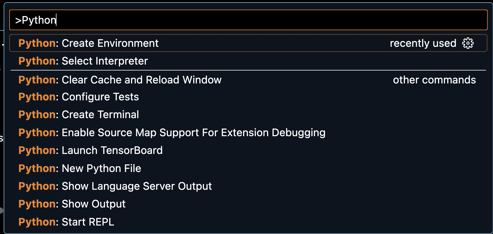

# Fabric file
 
## Setup and activate Python virtual env
### VS Code Approach (preferred)
- Press (Mac) Command-Shift-P for VS Code command window 
- Type Python 
- Select Create Environement



- Select Venv
- Select Python 3.10.# (3.11 will not work)

- Open a new integrated terminal and you should see that .venv is activated


- To manually activate run ```source .venv/bin/activate``` from root of repo


### Manual Approach
```
python3 -m venv testenv

source testenv/bin/activate
```

## install dependencies
```pip3 install -r requirements.txt```

#### create output directory for archive files
```
mkdir file_outputs
mkdir log_outputs
```

### create config.ini 
You need to create a file with customer id and token for observe dataset for sending data

[target-stage-tenant]
customer_id = 155575265738
domain = observe-staging
datastream_token = YOURS
### Run tests
Run ```fab test -h ``` for options


-s flag determines how lon to wait before running and is used by ci to wait 5 minutes for machines to come online
-b flag specifies remote branch version to use (if not supplied defaults to main)
-c specifies what config to use (if not supplied defaults to target-stage-tenant)

```fab test -s 0 -b mybranch```


