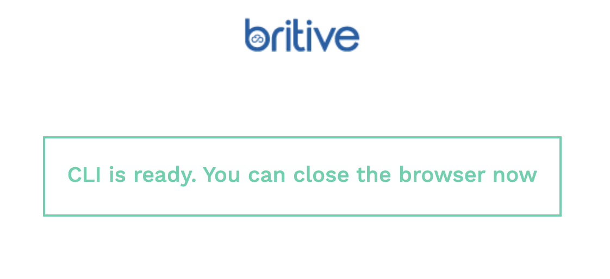

# FOR OBSERVE INTERNAL USERS 

## One Time Setup for Terraform AWS Sample Infrastructure
Clone or download this repository to your local machine

Observe uses Britive for employees to check out credentials to use against AWS accounts and uses dce to create ephemeral AWS accounts in our Blunderdome Account.

There are several dependencies you need to setup the first time you use this sample infrastructure.

### One Time Set Up for MAC
Upgrade bash if you don't have version 5
```
brew install bash
```

Install pybritive

```
pip3 install click pybritive urllib3==1.26.6

# if this gives you an error, remove the `urllib==1.26.6` from the command 
```

Install DCE
```
# Download the zip file - works on intel chip too
wget https://github.com/Optum/dce-cli/releases/download/v0.5.0/dce_darwin_amd64.zip

# Unzip to a directory on your path
unzip dce_darwin_amd64.zip -d /usr/local/bin
```
Initialize DCE
```
dce init
```

Update config file
```
cat <<EOF > ~/.dce/config.yaml
api:
  host: playground.observe-blunderdome.com
  basepath: /
  token: 
region: us-west-2
terraform:
  bin: null
  source: null
EOF
```


## Login 
Run script for sample interactive login command 
```
./make_me_env.sh
```
Will produce command for your local user that looks like:
```
./make_me_env.sh --principal_id YOU@observeinc.com --email YOU@observeinc.com
```

Run that command for interactive login you should see a screen like this (enter your email):


When you have success screen return to terminal:



Your terminal should look like:

